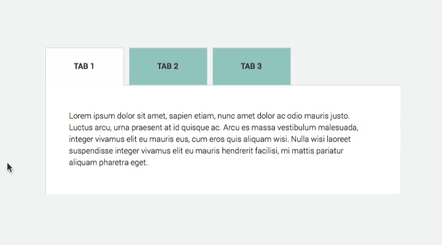

## CREACIÓN DE TABS

Este repositorio contiene una página web **Creación de Tabs**.

### Descripción general:
Crearmos 3 tabs con un **color diferente**. Donde al seleccionar un tabs se mostrara el contenido especifico de la pestaña seleccionada.

### Para desarrollar la animación:
1. Aplicaremos eventos y animacion para que las opciones del navegador se muestren o no se muestren segun la opcion.

### Herramientas Utilizadas:
1. HTML
2. CSS3
3. Javascript (Uso de DOM)

### Resultado final:
